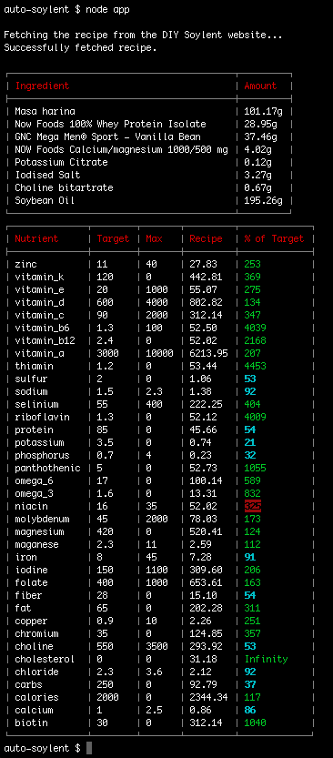

# Auto-Soylent

Although there are many theories on the best way to automatically generate soylent recipes, so far only 1 has been
attempted: https://github.com/nick/genetic-soylent

The purpose of this skeleton project is to provide a base from which developers can work on other ways to generate
soylent recipes automatically.

This first version lets you access the ingredient and nutrient targets from any of the recipes on the DIY Soylent
website. The base example is the popular "People Chow" recipe.

For a detailed discussion on generating soylent recipes automatically, see the thread on the Soylent forum:

http://discourse.soylent.me/t/genetic-algorithms-automatic-diy-soylent

## Goals

A successful implementation would, given a list of ingredients, generate a recipe with close to 100% of each of the
nutrients in a given profile.

The API should look something like this:

    generateRecipe(ingredients, nutrientTargets) {

        // code to generate recipe

        // return an array of quantities in the same order the ingredients were provided in.
        return ingredientQuantities;
    }

A nutrient profile looks like this:

    var nutrientProfile = {
        "name": "U.S. government DRI, male 19-50, 2000 calories",

        "calories": 2000,
        "calories_max": 2100,
        "protein": 85,
        "protein_max": 90,
        "fat": 65,
        "fat_max": 70,
        "calcium": 1,
        "calcium_max": 2.5,
        "vitamin_c": 90,
        "vitamin_c_max": 2000,
        ...
    }

Ingredients look like this:

    var ingredients = [
        {
            "name": "Masa harina",
            "serving": 100,
            "unit": "g",
            "calories": 365,
            "protein": 9.3,
            "fat": 3.86,
            "calcium": 0.141,
            "vitamin_c": 0,
            ...
        },
        {
            "name": "Now Foods 100% Whey Protein Isolate",
            "serving": 100,
            "unit": "g",
            "calories": 110,
            "protein": 25,
            "fat": 0.5,
            ...
        },
        ...
    ]

Note that the 'serving' and 'unit' properties denote the quantity of an ingredient the nutrient amounts relate to.
For example, in the ingredients above, 100g of Masa harina contains 365 calories and 9.3g protein.

## Implementation

This project was implemented in Javascript so that, if a successful solution is found, it can be re-incorporated to the
DIY Soylent website. The idea is that any user could automatically reconfigure a recipe to their nutrient profile.

## Installation

 - This project depends on Node.js and Git.
 - Visit http://nodejs.org/ to install node.js.
 - Visit http://try.github.io/ for a quick intro to Git and GitHub
 - Once you have node and git installed, clone this repository to your local machine
 - Run `npm install` to download the dependencies
 - Type `node app` to run the app.

## Example output

## Licence

MIT
